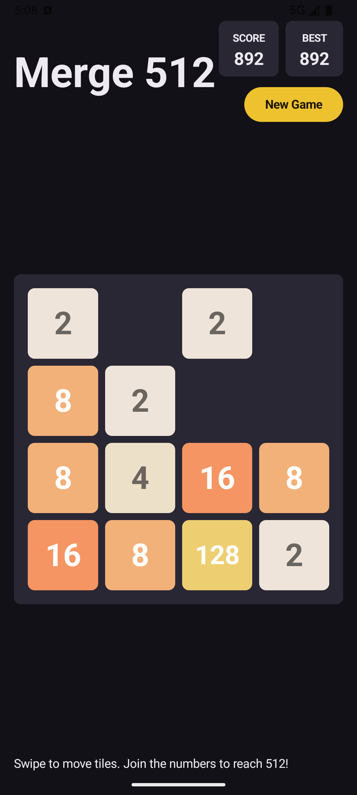
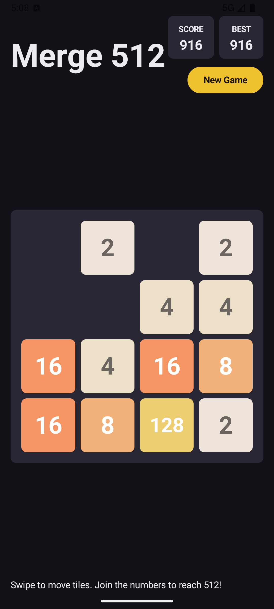
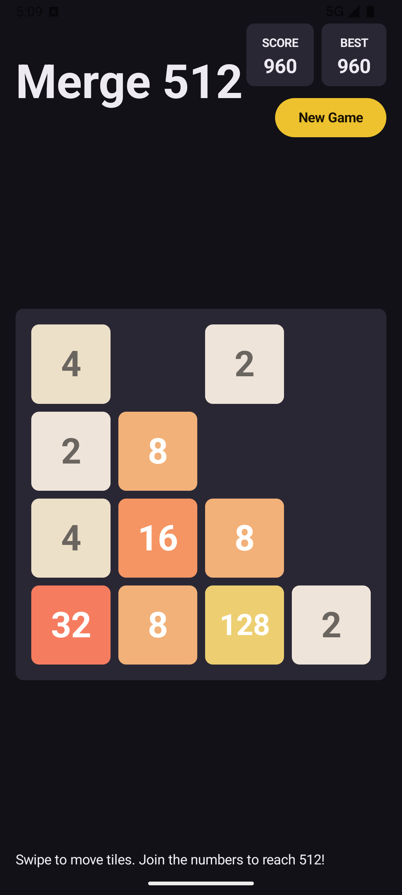

# Merge 512 — Native Android

A classic merge game built entirely with native Android technologies:

- **Kotlin**
- **Jetpack Compose** (stable)
- **Material 3**
- **AndroidX**
- **Gradle Kotlin DSL**

## Requirements

- Android Studio **Narwhal** (or newer)
- JDK 17+ (bundled with Android Studio)
- Internet access on first open (Gradle downloads dependencies)

## Open & Run

1. In Android Studio choose **File → Open…** and select this project's root folder.
2. Wait for **Gradle Sync** to finish (the wrapper downloads the correct Gradle version automatically).
3. Press **Run ▶** (or `Shift+F10`) to build and launch on a device or emulator.

No manual configuration is required — all dependencies, versions, and plugins are
pinned in `gradle/libs.versions.toml`.

## Configuration

| Setting        | Value |
|----------------|-------|
| **Android Gradle Plugin** | 9.3.1 |
| **Kotlin Version** | 2.2.10 |
| **Gradle Wrapper** | 9.5.0 |
| `minSdk`       | 26    |
| `targetSdk`    | 35    |
| `compileSdk`   | 35    |
| Orientation    | Portrait only |
| Application ID | `com.poliklinikvildan.merge512` |

## Features

- 4×4 board with two random starting tiles
- Swipe **left / right / up / down** to move
- Correct merge algorithm with **no double merge** per move
- New random tile after every valid move (90% → `2`, 10% → `4`)
- **Current score** and **Best score**
- **New Game** button (restart at any time)
- **Victory** overlay at 512 with *Keep Going* option
- **Game Over** overlay when no moves remain
- Smooth tile appear animations
- Dark mode Material 3 UI

## Project Structure

```
.
├── settings.gradle.kts
├── build.gradle.kts
├── gradle.properties
├── gradle/
│   ├── libs.versions.toml
│   └── wrapper/
│       └── gradle-wrapper.properties
└── app/
    ├── build.gradle.kts
    ├── proguard-rules.pro
    └── src/main/
        ├── AndroidManifest.xml
        ├── java/com/poliklinikvildan/merge512/
        │   ├── MainActivity.kt
        │   ├── engine/
        │   │   ├── GameEngine.kt
        │   │   └── GameViewModel.kt
        │   └── ui/
        │       ├── GameScreen.kt
        │       ├── GameBoard.kt
        │       ├── ScoreBar.kt
        │       ├── Overlays.kt
        │       └── theme/
        │           ├── Color.kt
        │           ├── Type.kt
        │           └── Theme.kt
        └── res/
            ├── drawable/
            │   ├── ic_launcher_background.xml
            │   └── ic_launcher_foreground.xml
            ├── mipmap-anydpi-v26/
            │   ├── ic_launcher.xml
            │   └── ic_launcher_round.xml
            ├── values/
            │   ├── strings.xml
            │   └── themes.xml
            └── xml/
                └── backup_rules.xml
```

## How to Play

Swipe in any direction to slide all tiles. When two tiles with the same number
touch, they **merge into one** with double the value. Reach the **512** tile to
win — then keep going for a higher score!

## Screenshots

| In progress State | In Progress | Win |
|:---:|:---:|:---:|
|  |  |  |
